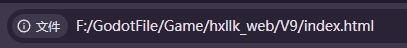
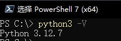
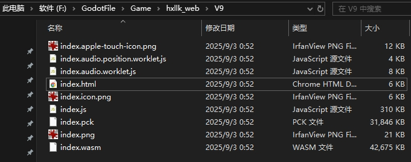
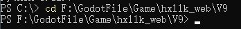
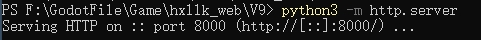
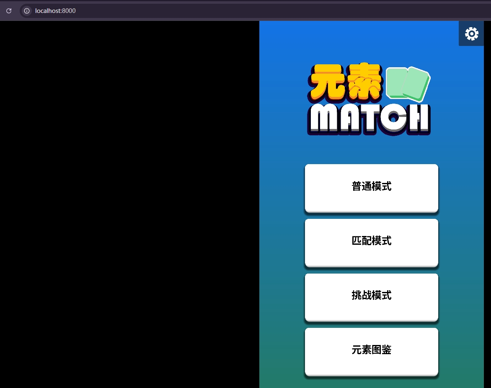

### Failed to fetch


### 原因
因为浏览器打开的是http开头，我们直接打开web包的index.html会看到是file开头。


### 使用Python
#### 1. 安装Python
#### 2. 确认Python版本号
```bash
# 根据是否失败，可以三选一
python -V
python3 -V
py -v
```

输入完会显示python的版本号。<br>
#### 3. cd导航自己的web包所在的文件夹
- 比如我的web包安装到如下路径。


输入命令
```bash
cd F:\GodotFile\Game\hxllk_web\V9
```
输入命令后


#### 4. 在目录下输入命令启动服务器
```bash
# 如果python 版本是 3.x
python3 -m http.server
# 如果python 版本是 2.x
python -m SimpleHTTPServer
```
输入命令后



5. 一般会在8000端口上启动本地服务器，输入命令后，会显示一个网址。
直接在浏览器输入该网址，即可直接打开web包。
URL ``http://localhost:8000``

最终效果



想要退出的话，在终端输入``CTRL + c`` 即可。
