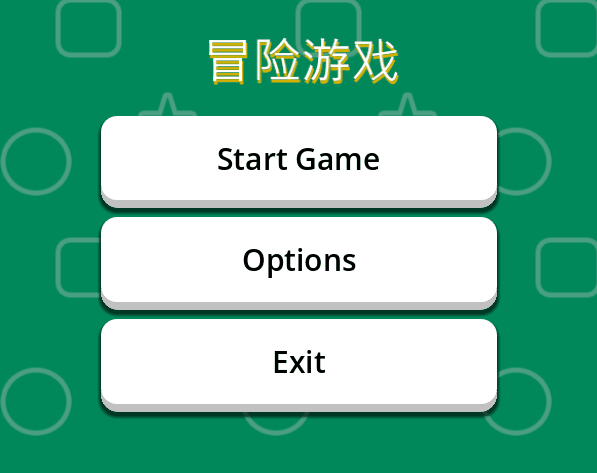
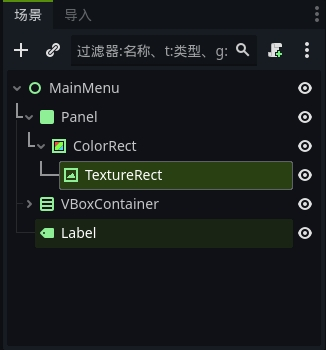
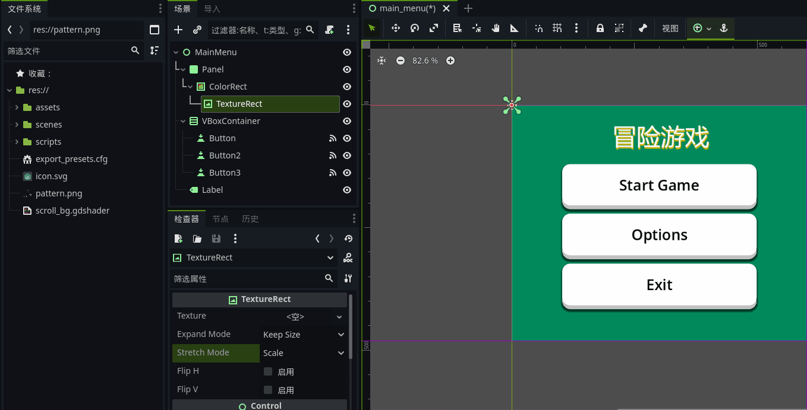
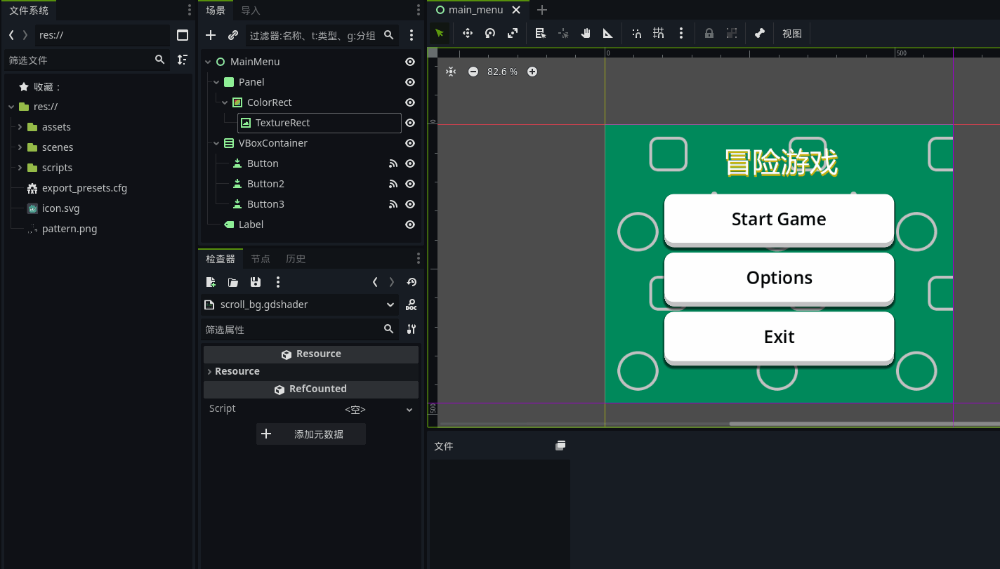
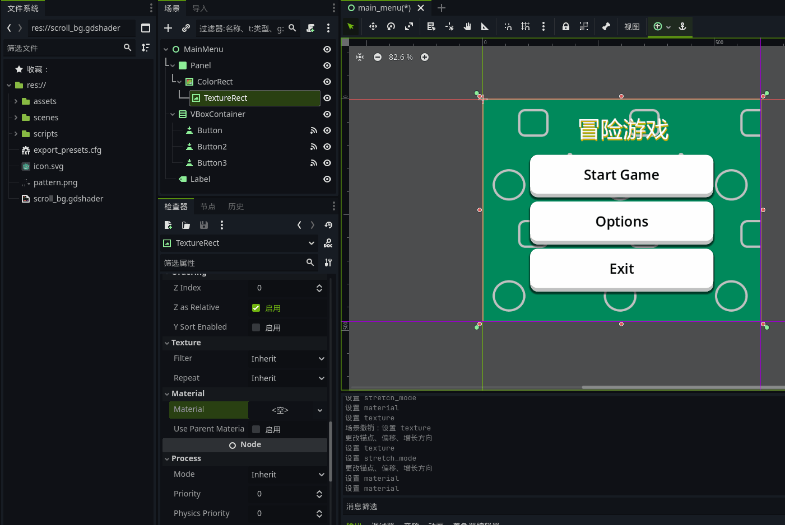
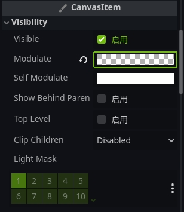
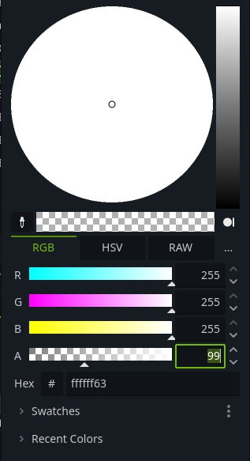

    最终效果图

### 准备资源
准备一张透明背景的图案，导入到资源里面（res://文件夹）。
</br>


### 创建TextureRect
在场景里面，创建TextureRect。

调整TextureRect。
- 准备的Pattern图拖拽到TextureRect的texture。
- TextureRect下方的Stretch Mode改为Tile。
- 锚点预设改为整个矩形。</br>
（这里可以根据自己的喜好，改成只显示部分区域）。


### 创建Shader资源
在资源中（res://文件夹），点击右键新建资源，搜索Shader并选中创建。
这里可以自己定义shader的名称，在这里我们定义名称为scroll_bg.gdshader。



打开创建的scroll_bg.gdshader, 输入代码。
```gdscript
shader_type canvas_item;

uniform float speed = .1; // 新增速度浮点数，这里可以调整滚动的速度。

void vertex() {
    // 根据时间偏移UV实现滚动
    UV.x += TIME * speed;  // 横向滚动
    UV.y += TIME * speed;  // 纵向滚动
}
```

### 增加Material
将我们所创建的scroll_bg.shader资源拖拽到TextureRect检查器中，CanvasItem的Material的Material里面。

Tada~我们就可以看到scoll pattern的效果，大功告成。

### 调整透明度
如果觉得滚动背景扰乱视觉，可以调整透明度。
- 可调整CanvasItem的Modulate。

- 然后调整调色板的rgba的a的数值进行修改即可。
